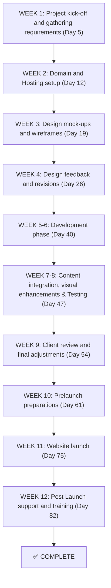

# WEB-DEVELOPMENT-POE-2

#### STUDENT INFORMATION:

### SIYOLISE VOKWANA
### ST10478691
### ROSEBANK COLLEGE CAPE TOWN

#### PROJECT OVERVIEW:
Is a NPO pursuing the mission to improve children’s literacy 
and combating youth unemployment led by Zama Zulu. Using 
data-driven, scalable programmes and creating meaningful 
local jobs for previously unemployed youth especially women 
as literacy coaches in early learning and primary school 
settings. The organisation was founded in 2008 by Jim 
McKeown and Fiks Mahola, they met in New Brighton in 
Gqeberha and bonded over shared passion for uplifting 
communities.   

#### PART 1 :
Part 1 is simply a proposal explaining the purpose of my website,more information about what is required to fix the existing website organisation that i have choosen,website goals and objectives,design and user experience etc 

#### PART 2 :
Part 2 consists of CSS Styling to add more colours and styles to the website,we are slowly moving away from the website being basic as we are implementing various user interactions 

#### PART 3 : 
Part 3 coming soon

#### WEBSITE GOALS AND OBJECTIVES:
I would like for the website to attract potential investors to this organisation, more people to 
see the cause and be an easy way to provide information to users/people of interest. More 
users interacting with the website means more people are aware of the cause, maybe some 
might be interested to assist to better the community and the children.  

#### KEY FUNCTIONS AND FUNCTIONALITY:
I would improve the websites navigation such as add search functions and site maps, make 
the website easier to use none of that complicated/amateur functions. I would like to show 
more visuals instead of text to catch the users attention. I would like to also use more fonts, 
colour palettes and layout choices. 

## CHANGE LOG:
-Updated my readme.md file 
-pushed the css folder to my WEB development POE 2 Depository
-Created the CSS FILE
-inserted the link code so my html files can be linked with the CSS FILE 
-On the 26 of september 2025 i implemented many changes to the CSS file such as changing code named colours to named colours also edited the code to have a pseudo class and also if other devices are used to navigate to this website it meets the requirements of the device such as device size, image resolutions and font size.Changed the colours to set a more vibrant user friendly field


#### REFERENCES:
## WEBSITES/ONLINE SOURCES:
Masinyusane. (n.d.) Masinyusane Development Organisation. [online] Available at: http://www.masinyusane.org
 [Accessed 26 August 2025].

HeraldLIVE. (n.d.) [Homepage]. [online] Available at: http://www.heraldlive.co.za
 [Accessed 26 August 2025].

Algoa FM. (n.d.) Algoa Cares: Masinyusane Development Organisation. [online] Available at: http://www.algoafm.co.za/algoa-cares/masinyusane-development-organisation
 [Accessed 26 August 2025].

Hosting24. (n.d.) Web Hosting Packages. [online] Available at: http://www.hosting24.co.za/web-hosting-packages
 [Accessed 26 August 2025].

mCloud9. (n.d.) Breaking Down Website Hosting Costs. [online] Available at: http://www.mcloud9.co.za/blog/breaking-down-website-hosting-costs
 [Accessed 26 August 2025].

Reddit. (2022) South Africa Thread Discussion. [online] Available at: https://www.reddit.com/r/southafrica/comments/vnas9z
 [Accessed 26 August 2025].

 #### IMAGES:

Masinyusane. (n.d.) Photo of Jim Mckeown and Fiks Mahola. [online image] Available at: https://www.masinyusane.org
 [Accessed 26 August 2025].

Masinyusane. (n.d.) Organisation logo. [online image] Available at: https://www.masinyusane.org
 [Accessed 26 August 2025].
 
## Timeline and Milestones




mermaid 


graph TD
    A[Homepage (index.html)]
    A --> B[About Us (about.html)]
    A --> C[Services (services.html)]
    A --> D[Enquiry (enquiry.html)]
    A --> E[Contact (contact.html)]

```


